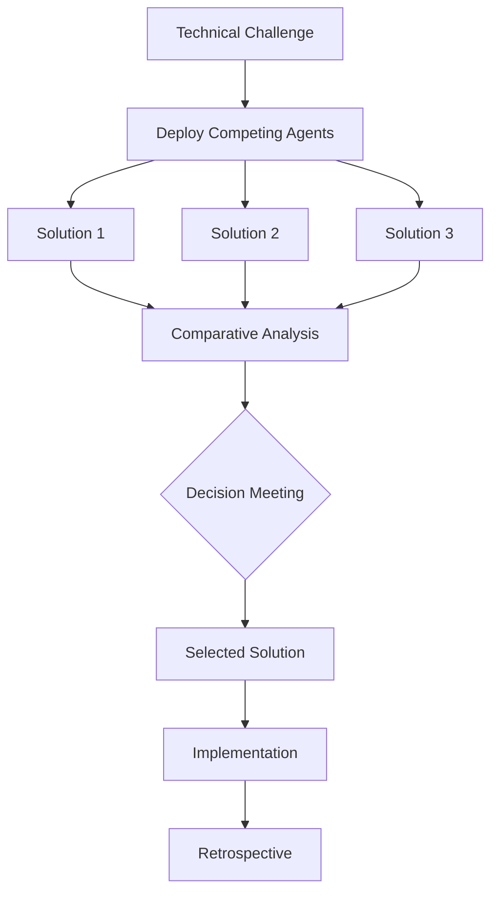

# Competing Solutions Example

This example shows how to use Claude Code agents to generate and compare multiple solution approaches for the same problem, helping you make informed architectural decisions.

## Use Case

When facing important technical decisions, having multiple agents propose different solutions helps explore the solution space thoroughly and avoid bias toward a single approach.

## The Pattern

```bash
"Deploy 2-3 agents to propose competing solutions for [problem]:
Agent 1: [Approach/Philosophy]
Agent 2: [Different Approach/Philosophy]  
Agent 3: [Alternative Approach/Philosophy]

Compare the solutions on: performance, maintainability, cost, and complexity"
```

## Real-World Example: Modernizing a Legacy System

### The Challenge

You have a 10-year-old monolithic e-commerce application that needs modernization. The system is struggling with scalability and deployment complexity.

### Step 1: Deploy Competing Architects

```markdown
I need to modernize our legacy e-commerce monolith. Deploy 3 specialized architects in parallel to propose competing solutions:

**Agent 1 - Incremental Modernizer**:
- Philosophy: Gradual transformation with minimal disruption
- Approach: Strangler fig pattern, careful extraction
- Priority: Business continuity and risk mitigation

**Agent 2 - Microservices Advocate**:
- Philosophy: Complete decomposition into microservices
- Approach: Domain-driven design, service mesh
- Priority: Scalability and team autonomy

**Agent 3 - Modular Monolith Architect**:
- Philosophy: Keep monolith but improve modularity
- Approach: Clean architecture, clear boundaries
- Priority: Simplicity and operational efficiency

Each agent should provide:
1. Detailed implementation plan
2. Timeline and milestones
3. Risk assessment
4. Cost estimation
5. Team requirements
```

### Step 2: Expected Outputs

#### Solution 1: Incremental Modernization

```markdown
## Incremental Modernization Strategy

### Approach
Use the Strangler Fig pattern to gradually extract services while keeping the monolith running.

### Implementation Plan
**Phase 1 (Months 1-3): Foundation**
- Set up API gateway
- Implement feature flags
- Create shared data access layer
- Extract user authentication service

**Phase 2 (Months 4-6): Core Services**
- Extract payment processing
- Separate inventory management
- Move order processing

**Phase 3 (Months 7-12): Completion**
- Extract remaining services
- Decommission monolith
- Optimize service communication

### Pros
- ✅ Low risk - rollback possible at any stage
- ✅ Business continues uninterrupted
- ✅ Team learns gradually
- ✅ Costs spread over time

### Cons
- ❌ Slower transformation
- ❌ Temporary complexity increase
- ❌ Requires maintaining two systems

### Risk Assessment: LOW
- Proven pattern with escape hatches
- Each phase independently valuable

### Cost: $500K over 12 months
- No big-bang migration
- Gradual team scaling
```

#### Solution 2: Microservices Architecture

```markdown
## Full Microservices Transformation

### Approach
Complete rewrite as microservices with modern stack and service mesh.

### Implementation Plan
**Phase 1 (Months 1-2): Architecture Design**
- Domain modeling workshops
- Service boundary definition
- Technology stack selection
- Infrastructure setup (K8s, Istio)

**Phase 2 (Months 3-8): Parallel Development**
- 5 teams building services simultaneously
- API-first development
- Comprehensive testing

**Phase 3 (Months 9-10): Migration**
- Data migration strategy
- Blue-green deployment
- Cutover weekend

### Pros
- ✅ Modern architecture from day one
- ✅ Independent team scaling
- ✅ Technology flexibility per service
- ✅ Cloud-native benefits

### Cons
- ❌ High initial complexity
- ❌ Requires skilled teams
- ❌ Operational overhead
- ❌ Network latency issues

### Risk Assessment: HIGH
- Big-bang migration risk
- Distributed system complexity

### Cost: $2M over 10 months
- 5 development teams
- Infrastructure costs
- Training and consultants
```

#### Solution 3: Modular Monolith

```markdown
## Modular Monolith Approach

### Approach
Refactor existing monolith into well-defined modules with clear boundaries.

### Implementation Plan
**Phase 1 (Months 1-2): Module Definition**
- Analyze existing code
- Define module boundaries
- Create module interfaces
- Set up module testing

**Phase 2 (Months 3-6): Refactoring**
- Extract modules incrementally
- Implement dependency injection
- Create module APIs
- Add module documentation

**Phase 3 (Months 7-8): Optimization**
- Performance tuning
- Deployment pipeline updates
- Monitoring additions

### Pros
- ✅ Maintains operational simplicity
- ✅ No distributed system complexity
- ✅ Easier debugging and testing
- ✅ Lower infrastructure costs

### Cons
- ❌ Still a monolith for scaling
- ❌ Technology locked to single stack
- ❌ Team coordination still required
- ❌ Limited service autonomy

### Risk Assessment: MEDIUM
- Refactoring risks
- May need microservices later

### Cost: $300K over 8 months
- Existing team with additions
- Minimal infrastructure changes
```

### Step 3: Comparative Analysis

```markdown
## Solution Comparison Matrix

| Criteria | Incremental | Microservices | Modular Monolith |
|----------|-------------|---------------|------------------|
| Risk Level | Low | High | Medium |
| Time to Value | 3 months | 10 months | 2 months |
| Total Cost | $500K | $2M | $300K |
| Complexity | Medium | High | Low |
| Scalability | High | Very High | Medium |
| Team Impact | Gradual | Significant | Minimal |
| Maintenance | Medium | High | Low |
| Future Proof | High | Very High | Medium |

## Recommendation

Based on the analysis, **Incremental Modernization** is recommended because:
1. Balances risk and reward
2. Allows learning and adjustment
3. Provides early value delivery
4. Keeps options open for future

However, if the organization has:
- High risk tolerance
- Experienced distributed systems teams
- Budget for transformation

Then **Microservices** could provide better long-term value.
```

## Other Competing Solution Scenarios

### 1. API Design Approaches

```markdown
"Design our new API using three different approaches:
1. REST Purist: Strict RESTful principles
2. GraphQL Advocate: Single graph endpoint
3. Pragmatic API Designer: REST with practical compromises

Compare on: developer experience, performance, and flexibility"
```

### 2. State Management Solutions

```markdown
"Propose state management for our React app:
1. Redux Expert: Classic Redux with RTK
2. Context Specialist: React Context + useReducer
3. Modern State Advocate: Zustand/Valtio/Jotai

Evaluate on: boilerplate, performance, developer experience"
```

### 3. Database Architecture

```markdown
"Design our database architecture:
1. SQL Traditionalist: PostgreSQL with normalized schema
2. NoSQL Advocate: MongoDB with denormalized documents
3. Polyglot Persistence Expert: Mix of databases per use case

Compare on: consistency, scalability, query flexibility, operational complexity"
```

## Benefits of Competing Solutions

1. **Avoid Confirmation Bias**: Multiple perspectives prevent tunnel vision
2. **Discover Trade-offs**: Clear understanding of pros and cons
3. **Risk Assessment**: Different approaches highlight different risks
4. **Team Buy-in**: Transparent decision process
5. **Future Reference**: Document why decisions were made

## Tips for Effective Competition

### 1. Fair Competition Rules
- Give each agent same constraints
- Require same deliverables
- Use consistent evaluation criteria
- Allow equal time/resources

### 2. Structured Evaluation
```markdown
## Evaluation Framework
- Technical Merit (40%)
  - Performance
  - Scalability
  - Maintainability
- Business Impact (30%)
  - Time to market
  - Cost
  - Risk
- Team Factors (30%)
  - Learning curve
  - Hiring needs
  - Operational burden
```

### 3. Decision Documentation
```markdown
## Architecture Decision Record (ADR)

### Title: Database Selection for User Service

### Status: Accepted

### Context
Need to choose database for new user service handling 1M+ users

### Options Considered
1. PostgreSQL - Proposed by SQL Traditionalist
2. MongoDB - Proposed by NoSQL Advocate  
3. DynamoDB - Proposed by Serverless Expert

### Decision
PostgreSQL selected based on:
- Strong consistency requirements
- Complex relational queries needed
- Team expertise available

### Consequences
- Need to plan for scaling strategy
- Must implement caching layer
- Regular backup procedures required
```

## Integration with Decision-Making



## Advanced Patterns

### 1. Progressive Refinement
```markdown
Round 1: High-level approaches (3 agents)
Round 2: Deep dive on top 2 approaches
Round 3: Prototype critical aspects
Round 4: Final recommendation
```

### 2. Hybrid Solutions
```markdown
"After reviewing all proposals, create a hybrid solution combining:
- Security approach from Agent 1
- Scalability design from Agent 2  
- Operational simplicity from Agent 3"
```

### 3. Future-State Scenarios
```markdown
"For each solution, project the architecture in:
- 6 months: Initial state
- 2 years: Growth state
- 5 years: Mature state

Consider: technical debt, scaling costs, team size"
```

Remember: The goal isn't to find a perfect solution, but to make an informed decision with clear understanding of trade-offs. Competing solutions ensure you've explored the solution space thoroughly before committing.