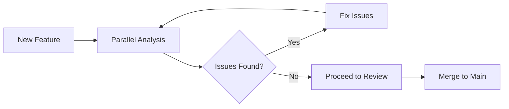

# Parallel Analysis Example

This example demonstrates how to use multiple Claude Code agents in parallel to analyze a codebase from different perspectives, gathering comprehensive insights quickly.

## Use Case

When you need to understand a new codebase or perform a comprehensive analysis of an existing project, deploying multiple specialized agents in parallel can provide deeper insights in less time.

## The Command

```bash
"Analyze this codebase using 4 parallel agents:
1. Architecture Analyst: Focus on overall structure, design patterns, and architectural decisions
2. Security Auditor: Look for vulnerabilities, security best practices, and potential risks  
3. Performance Reviewer: Identify bottlenecks, optimization opportunities, and resource usage
4. Code Quality Inspector: Check maintainability, test coverage, and coding standards"
```

## Example Workflow

### Step 1: Initial Setup

First, ensure you have the necessary agents configured. You can use the provided templates or create custom ones:

```bash
# Check available agents
/agents

# If needed, create specialized agents
mkdir -p .claude/agents
```

### Step 2: Execute Parallel Analysis

```markdown
Claude, I need a comprehensive analysis of this codebase. Deploy 4 specialized agents in parallel:

1. **Architecture Analyst**: Map out the system architecture, identify design patterns, analyze module dependencies, and document architectural decisions

2. **Security Auditor**: Scan for OWASP Top 10 vulnerabilities, check authentication/authorization implementations, review data handling, and identify security risks

3. **Performance Reviewer**: Profile potential bottlenecks, analyze database queries, check caching strategies, and review resource management

4. **Code Quality Inspector**: Evaluate code maintainability, check test coverage, identify code smells, and assess documentation quality

Each agent should provide a structured report with findings, risk levels, and recommendations.
```

### Step 3: Expected Output

The orchestrator will coordinate the agents and provide consolidated results:

```markdown
## Codebase Analysis Report

### Architecture Analysis (by architecture-analyst)
**Overall Structure**: Microservices architecture with 5 services
- **Design Patterns**: Repository, Factory, Observer
- **Key Findings**:
  - Well-separated concerns between services
  - Some circular dependencies in user-service
  - Missing API gateway for external access
- **Recommendations**: 
  - Implement API gateway
  - Refactor user-service dependencies

### Security Audit (by security-auditor)
**Risk Level**: Medium
- **Vulnerabilities Found**:
  - SQL injection risk in search endpoint
  - Missing rate limiting on API
  - Passwords stored with weak hashing
- **Critical Issues**: 2
- **Recommendations**:
  - Use parameterized queries
  - Implement rate limiting
  - Upgrade to bcrypt for passwords

### Performance Review (by performance-reviewer)
**Performance Score**: 7/10
- **Bottlenecks Identified**:
  - N+1 queries in product listing
  - No caching on frequently accessed data
  - Large payload sizes in API responses
- **Optimization Opportunities**: 5
- **Quick Wins**:
  - Add database indexes
  - Implement Redis caching
  - Add pagination to listings

### Code Quality Report (by quality-inspector)
**Maintainability Index**: B+
- **Test Coverage**: 67%
- **Code Smells**: 23 detected
- **Documentation**: Partial (missing API docs)
- **Technical Debt**: Medium
- **Improvements Needed**:
  - Increase test coverage to 80%
  - Add JSDoc comments
  - Refactor large functions
```

## Advanced Variations

### 1. Comparative Analysis

```markdown
"Compare our codebase with industry best practices using 3 agents:
- Standards Compliance Checker
- Best Practices Evaluator  
- Modern Patterns Advisor"
```

### 2. Pre-Release Audit

```markdown
"Perform pre-release audit with parallel agents:
- Security Final Check
- Performance Baseline
- Breaking Changes Detector
- Documentation Completeness"
```

### 3. Technical Debt Assessment

```markdown
"Assess technical debt from multiple angles:
- Code Complexity Analyzer
- Dependency Auditor
- Refactoring Opportunity Finder
- Test Debt Calculator"
```

## Benefits of Parallel Analysis

1. **Time Efficiency**: Get comprehensive results in the time it takes for one analysis
2. **Specialized Expertise**: Each agent focuses deeply on their domain
3. **Comprehensive Coverage**: No aspect is overlooked
4. **Unbiased Perspectives**: Different agents may catch different issues
5. **Actionable Insights**: Consolidated report with prioritized actions

## Tips for Effective Parallel Analysis

1. **Clear Scope**: Define what each agent should focus on
2. **Structured Output**: Request specific format for easier consolidation
3. **Priority Levels**: Ask agents to categorize findings by severity
4. **Actionable Recommendations**: Request specific fixes, not just problems
5. **Time Boxes**: Set reasonable time limits for each analysis

## Integration with Development Workflow



This parallel analysis pattern can be integrated into:
- Code review processes
- Sprint planning
- Architecture decision records
- Technical debt management
- Security audit cycles

## Customization Ideas

Create specialized agent teams for different scenarios:

### For Frontend Projects
- React Best Practices Analyzer
- Accessibility Auditor
- Performance Budget Checker
- CSS Architecture Reviewer

### For Backend Services
- API Design Validator
- Database Schema Optimizer
- Scalability Analyzer
- Integration Point Reviewer

### For DevOps
- Infrastructure Security Scanner
- Cost Optimization Analyzer
- Disaster Recovery Validator
- Monitoring Coverage Checker

Remember: The power of parallel analysis lies in getting multiple expert perspectives simultaneously. Use it whenever you need comprehensive understanding quickly.